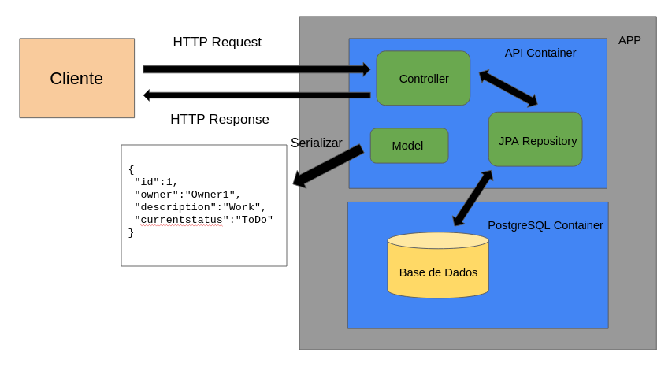
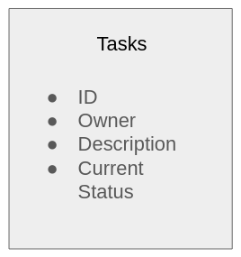

# ToDo List 

## Requisitos
- [Docker](https://www.docker.com/)
- [Docker Compose](https://docs.docker.com/compose/install/)

## Descrição

Este projeto consiste em uma api implementada em Java e SpringBoot para fazer um ToDo List.
A aplicação também conta com um banco de dados PostgreSQL e testes implementados utilizando TestContainers.

### Diagrama da Aplicação

### Base de Dados
- A base de dados consta com apenas uma tabela denominada `tasks` e alguns atributos.
- Você pode consultar mais informações no script SQL localizado em: `init-scripts/initialize.sql`

## Execução da Aplicação

* Após clonar este projeto, entre na pasta raiz e abra um terminal.
* Para executar a aplicação digite o comando: `sudo docker compose up`
  * OBS: Para que o build funcionasse corretamente os testes foram pulados durante o processo, mas se você tiver o Intellij IDEA ou outro software equivalente, será capaz de efetuar todos os testes.
* No final do build da aplicação dois containers docker irão ser criados.
* Um container para a api e outro para a base de dados PostgreSQL.

## Endpoints da Aplicação

- Listar Tarefas: Método GET
  - `localhost:8080/api/v1/tasks`
  - `localhost:8080/api/v1/tasks/ToDo`
  - `localhost:8080/api/v1/tasks/Done`
  - `localhost:8080/api/v1/tasks/owner/{owner}`
  - `localhost:8080/api/v1/tasks/id/{id}`

- Cadastrar Tarefas: Método POST
  - `localhost:8080/api/v1/tasks`
  
- Completar Tarefa: Método PUT
  - `localhost:8080/api/v1/tasks/{id}`

- Deletar Tarefa: Método DELETE
  - `localhost:8080/api/v1/tasks/{id}`
